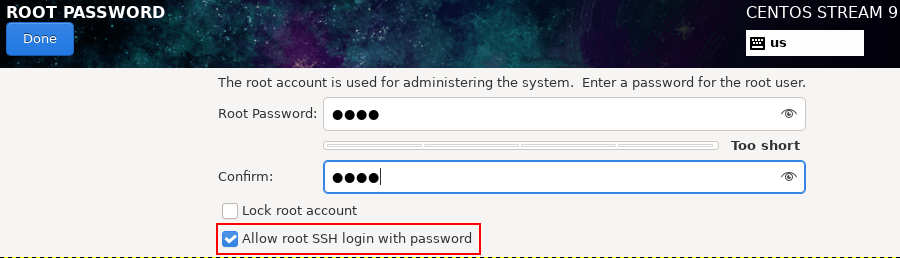
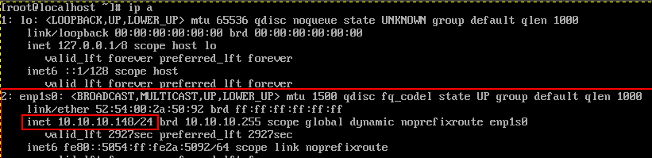
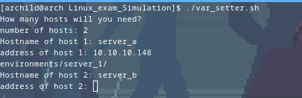
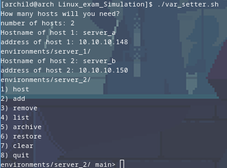

# Linux Exam Simulation
This is a collection of scripts that simulates exams on a linux environment.
It's written in bash, uses ssh to go into any number of VMs to setup the environment, and then grade these problems, once you finish the exam.
## How to use:
### Prerequisites
Disclaimer: This was tested on CentOS 9
First download [centos 9 iso](https://www.centos.org/download/)
During the Installation process on all the virtual machines, setup the root user and allow ssh into it.

Since this collection of scripts assumes it'll be run as root.
then clone this repo
```
git clone https://github.com/axolotlite/Linux_exam_Simulation.git
```
### First: Setting up the hosts
run the following command in your shell to get the VMs ip address:
```
ip a
```

repeat this for all the VMs you'll be using.
Next run `./var_setter.sh`
you'll be prompted to set up the number of hosts you'll be using:
then you'll have to set the hostname and ip address of each host

Then you'll be directed into the main menu where you'll be able to select hosts to add or remove setup / problem scripts, list currently selected ones or even archive and restore previous variables and configurations.


### Second: Deploying the scripts to the VMs
send the ssh-keys to the vms:
```
./remote.sh -t 
```
then start the setup scripts:
```
./remote.sh -s -v
```
now, the virtual machines are setup, you can either ssh into them to practice the exam or use the vm gui.
### Grading
after you finish it you can grade the questions you selected in `var_setter.sh` through:
```
./remote.sh -g -v
```

____

## Directories
These are the directories in the project and their relevant uses
##### archive
This directory contains .tar files that contains exams.
##### credentials
contains keys, certificates and any other credentials.
##### environments
environmental files and .var scripts that will be fed to scripts.
##### exams
deprecated and are currently unused
##### patches
SPEC patch files, if you want to generate custom packages during yum repo initialization
##### problems
scripts that check for problem solution, each script should contain the problem definition and relevant variables.
##### scripts
Initialization scripts for VMs, it's used to setup problems or the environment.
